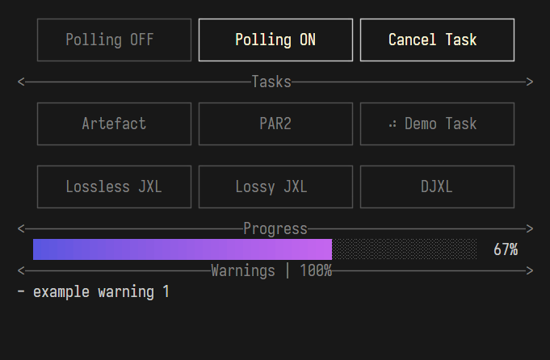

# exputils

"Adding" extra buttons to Windows Explorer by utilizing a separate TUI application that continuously monitors the currently open folder in Explorer.

> This application is the successor to my previous project [gallery-preprocessor-go](https://github.com/Delnegend/gallery-preprocessor-go), but upon completion, I realized that a drag-and-drop UI would be more convenient.

